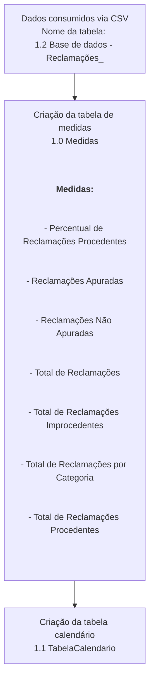

# projeto_reclamacoes

```mermaid

graph TD;
    A[Dados consumidos via CSV<br>Nome da tabela: <br>1.2 Base de dados - Reclamações_] --> B[Criação da tabela de medidas<br>1.0 Medidas<br><ul style="list-style-type: none; padding-left: 0;">
    <li><strong>Medidas:</strong></li>
    <li>- Percentual de Reclamações Procedentes</li>
    <li>- Reclamações Apuradas</li>
    <li>- Reclamações Não Apuradas</li>
    <li>- Total de Reclamações</li>
    <li>- Total de Reclamações Improcedentes</li>
    <li>- Total de Reclamações por Categoria</li>
    <li>- Total de Reclamações Procedentes</li>
    </ul>];
    B --> C[Criação da tabela calendário<br>1.1 TabelaCalendario];


```