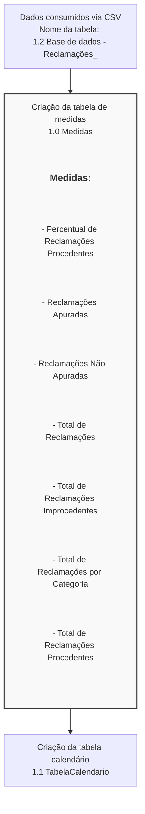

# projeto_reclamacoes

```mermaid

graph TD;
    style B fill:#f9f9f9,stroke:#333,stroke-width:2px;
    A[Dados consumidos via CSV<br>Nome da tabela: <br>1.2 Base de dados - Reclamações_] --> B[Criação da tabela de medidas<br>1.0 Medidas<br><div style="padding: 16px;">
    <h3 style="margin-top: 0;">Medidas:</h3>
    <div style="background-color: #f0f0f0; padding: 8px; border-radius: 5px; margin-bottom: 8px;">- Percentual de Reclamações Procedentes</div>
    <div style="background-color: #f0f0f0; padding: 8px; border-radius: 5px; margin-bottom: 8px;">- Reclamações Apuradas</div>
    <div style="background-color: #f0f0f0; padding: 8px; border-radius: 5px; margin-bottom: 8px;">- Reclamações Não Apuradas</div>
    <div style="background-color: #f0f0f0; padding: 8px; border-radius: 5px; margin-bottom: 8px;">- Total de Reclamações</div>
    <div style="background-color: #f0f0f0; padding: 8px; border-radius: 5px; margin-bottom: 8px;">- Total de Reclamações Improcedentes</div>
    <div style="background-color: #f0f0f0; padding: 8px; border-radius: 5px; margin-bottom: 8px;">- Total de Reclamações por Categoria</div>
    <div style="background-color: #f0f0f0; padding: 8px; border-radius: 5px;">- Total de Reclamações Procedentes</div>
    </div>];
    B --> C[Criação da tabela calendário<br>1.1 TabelaCalendario];


```